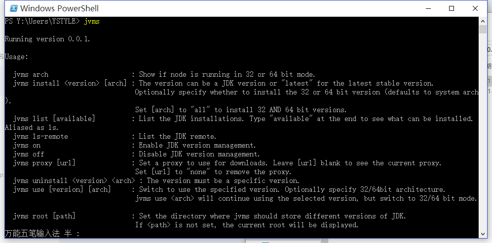
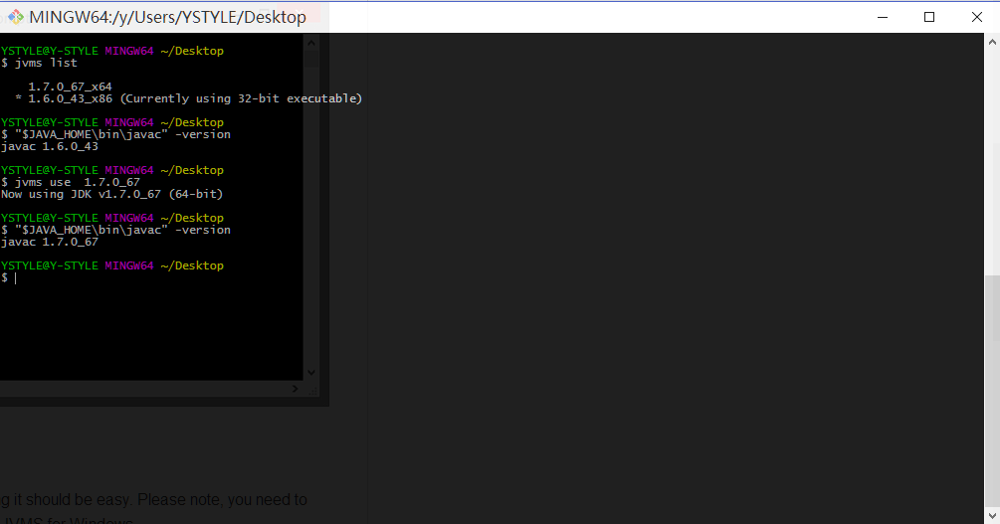
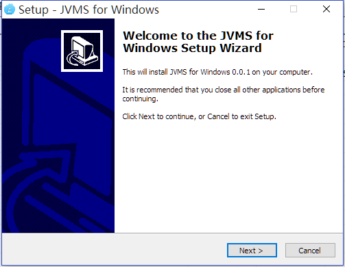

# JDK Version Manager (JVMS) for Windows

Manage multiple installations of JDK on a Windows computer.
**tl;dr** [JVMS](https://github.com/ystyle/jvms), but for Windows, with an installer. [Download Now](https://github.com/ystyle/jvms/releases)!

This repo fork from [nvm-windows](https://github.com/coreybutler/nvm-windows) .

There are situations where the ability to switch between different versions of JDK can be very
useful. For example, if you want to test a project you're developing with the latest
bleeding edge version without uninstalling the stable version of JDK, this utility can help.

### Installation & Upgrades

It comes with an installer (and uninstaller), because getting it should be easy. Please note, you need to uninstall any existing versions of node.js before installing JVMS for Windows.

[Download the latest installer from the releases](https://github.com/ystyle/jvms/releases).

**To upgrade**, run the new installer. It will safely overwrite the files it needs to update without touching your node.js installations.
Make sure you use the same installation and symlink folder. If you originally installed to the default locations, you just need to click
"next" on each window until it finishes.

### Usage

JVMS for Windows is a command line tool. Simply type `jvms` in the console for help. The basic commands are:

- `jvms arch [32|64]`: Show if JDK is running in 32 or 64 bit mode. Specify 32 or 64 to override the default architecture.
- `jvms install <version> [arch]`: The version can be a JDK version or "latest" for the latest stable version. Optionally specify whether to install the 32 or 64 bit version (defaults to system arch). Set `[arch]` to "all" to install 32 AND 64 bit versions.
- `jvms list [available]`: List the JDK installations. Type `available` at the end to show a list of versions available for download.
- `jvms on`: Enable JDK version management.
- `jvms off`: Disable JDK version management (does not uninstall anything).
- `jvms proxy [url]`: Set a proxy to use for downloads. Leave `[url]` blank to see the current proxy. Set `[url]` to "none" to remove the proxy.
- `jvms uninstall <version>`: Uninstall a specific version.
- `jvms use <version> [arch]`: Switch to use the specified version. Optionally specify 32/64bit architecture. `jvms use <arch>` will continue using the selected version, but switch to 32/64 bit mode based on the value supplied to `<arch>`.
- `jvms root <path>`: Set the directory where jvms should store different versions of JDK. If `<path>` is not set, the current root will be displayed.
- `jvms version`: Displays the current running version of JVMS for Windows.

---

## What's the big difference?

First and foremost, this version of jvms has no dependency on node. It's written in [Go](http://golang.org/), which is a much more structured
approach than hacking around a limited `.bat` file. It does not rely on having an existing node installation. Plus, should the need arise, Go
offers potential for creating a Mac/Linux version on the same code base with a substanially easier migration path than converting a bunch of
batch to shell logic. `bat > sh, it crazy, right?`

The control mechanism is also quite different. There are two general ways to support multiple node installations with hot switching capabilities.
The first is to modify the system `PATH` any time you switch versions, or bypass it by using a `.bat` file to mimic the node executable and redirect
accordingly. This always seemed a little hackish to me, and there are some quirks as a result of this implementation.

The second option is to use a symlink. This concept requires putting the symlink in the system `PATH`, then updating its target to
the node installation directory you want to use. This is a straightforward approach, and seems to be what people recommend.... until they
realize just how much of a pain symlinks are on Windows. This is why it hasn't happened before.

In order to create/modify a symlink, you must be running as an admin, and you must get around Windows UAC (that annoying prompt). Luckily, this is
a challenge I already solved with some helper scripts in [node-windows](http://github.com/coreybutler/node-windows). As a result, JVMS for Windows
maintains a single symlink that is put in the system `PATH` during installation only. Switching to different versions of JDK is a matter of
switching the symlink target. As a result, this utility does **not** require you to run `jvms use x.x.x` every time you open a console window.
When you _do_ run `jvms use x.x.x`, the active version of node is automatically updated across all open console windows. It also persists
between system reboots, so you only need to use jvms when you want to make a change.

JVMS for Windows comes with an installer, courtesy of a byproduct of my work on [Fenix Web Server](http://fenixwebserver.com).

Overall, this project brings together some ideas, a few battle-hardened pieces of other modules, and support for newer versions of JDK.

I also wrote a simple [data feed](http://github.com/ystyle/jvms) containing a list of node.js versions and their associated npm version.
This is how JDK for Windows recognizes the "latest" stable version. It's free for anyone to use.

## Motivation

I needed it, plain and simple. Additionally, it's apparent that [support for multiple versions](https://github.com/joyent/node/issues/8075) is not
coming to node core, or even something they care about. It was also an excuse to play with Go.

## Submit other jdk Version url
[Click here](submit.md)

## License

MIT.
